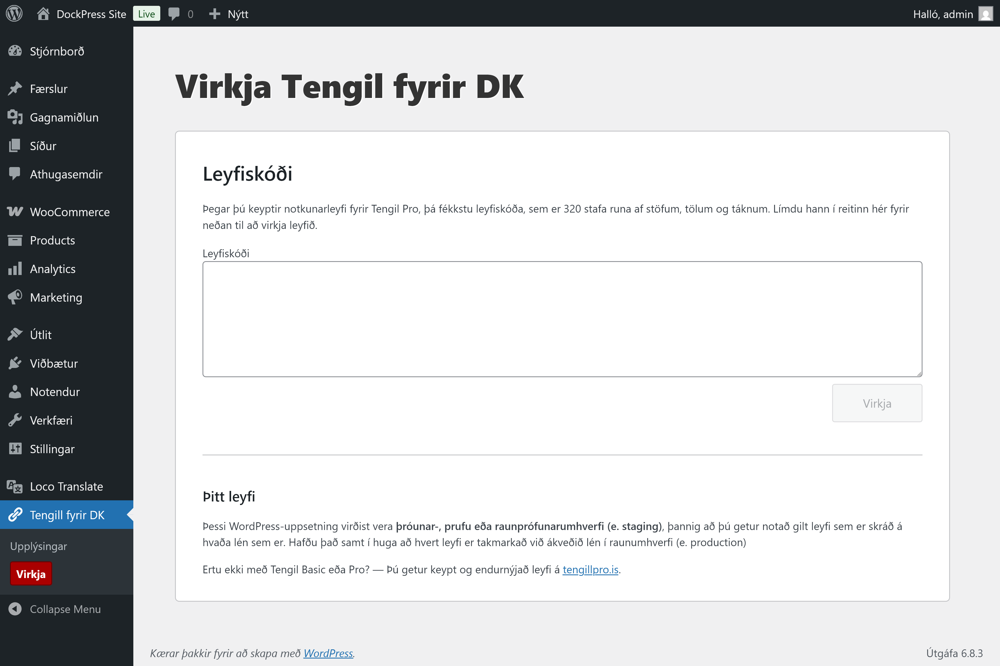

# Leyfiskóðar

Við kaup á Tengli Pro fyrir DK er gefinn út leyfiskóði sem gildir eingöngu fyrir **eitt lén**. Þetta er 320 stafa runa af bókstöfum, tölum og öðrum táknum. Ef leyfið var keypt beint af höfundi á [tengillpro.is](https://tengillpro.is/), þá birtist þessi kóði eftir að greiðsla hefur farið fram.

Við skráningu á leyfiskóða færðu aðgang að sjálfvirkum uppfærslum og þeirri virkni sem Tengill Pro fyrir DK hefur uppá að bjóða umfram ókeypis útgáfuna sem fæst á WordPress.org.

Hver leyfiskóði er gefinn út fyrir eitt lén, en hægt er að nota viðbótina í þróunar-, prófunar- og raun&shy;prófunar&shy;umhverfi (e. development, test, staging).

Notuð er tveggja þátta RSA-dulkóðun til að búa til og lesa leyfiskóðana. Eins og er, þá er ekki notast við utanaðkomandi þjónustu til að auðkenna þessa lykla, heldur fer athugun á þeim fram í bakendakerfi þinnar WordPress-uppsetningar. Það er því ekki ekki hægt að draga leyfiskóða til baka og þ.a.l. ekki boðið uppá endurgreiðslu fyrir notkunarleyfi.

## Endurútgáfa leyfiskóða

Ekki er hægt að flytja leyfiskóða á milli léna. Ef þú ert með leyfi sem gilti upprunalega í eitt ár og vefverslunin þín er sannarlega að færa sig á milli léna eða ef þú hefur slegið rangt lén inn við kaup, þá er hægt að hafa samband og biðja um kóða fyrir nýtt lén.

## Endursala

## Bannað að stela

Tengill Pro fyrir DK er frjáls hugbúnaður, gefinn út skv. GPLv3-leyfinu og skrifaður í PHP án allra leiða til að hylja grunnkóðann. Þetta þýðir að það er nokkuð auðsótt mál að finna leiðir til að slökkva á allri virkni sem tengist því að virkja hugbúnaðinn og leyfa t.d. falsaða leyfiskóða og jafnvel koma Tengli Pro í dreifingu án endurgjalds.

Ef þú ætlar að gera eitthvað slíkt, hafðu það þá í huga að Tengill fyrir DK er lifibrauð einyrkja með rekstur á eigin nafni, sem nær ekki alltaf endum saman.
