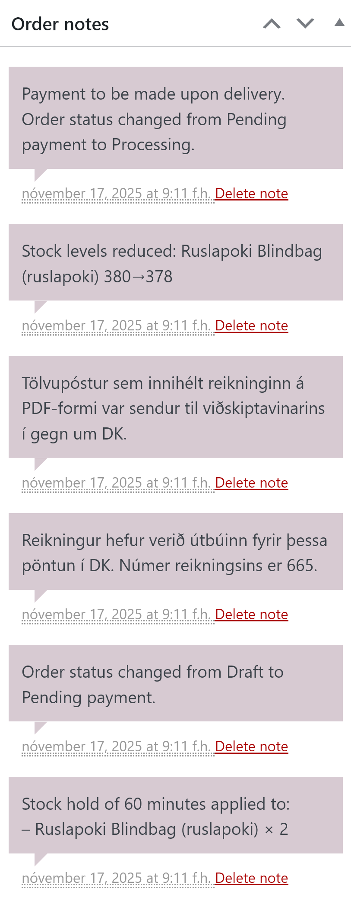

# Pantanir og reikningar

Tengill fyrir DK bætir eftirfarandi inn í pantanaviðmótið:

* Kennitala er skráð á heimilisfang reiknings
* Í hliðarstiku er bæði hægt að skrá og skoða reikninga
* Atburðaskrá er birt undir *Order Notes*

## Að útbúa reikninga

Ef reikningur er ekki búinn til sjálfkrafa er hægt að útbúa reikninga handvirkt með því smella á happ í liðarstikunni undir liðnum *Reikningur í DK* til að útbúa reikning handvirkt og þá skráist númer reikningsins á pöntunina sjálfkrafa. Ennfremur er hægt að handskrá reikningsnúmer ef reikningur hefur verið útfærður í DK eða dkPlus.

Númer kreditreiknings er einnig hægt að skrá við pöntun.

Reikningar sem sóttir eru á PDF-formi frá DK eru eingöngu geymdir í stutta stund í senn. Þetta er gert vegna öryggis- og persónu&shy;verndar&shy;sjónarmiða. Það er því ekki góð hugmynd að senda viðskiptavinum eða samstarfsfólki vefhlekk á PDF-útgáfuna nema hann sé opnaður strax.

## Ferill pöntunar

Í hliðarstikunni undir *Order Notes* er ferill pöntunarinnar skráður; þ.m.t. númer reiknings, breytingar á lagerstöðu fyrir þær vörur sem eru pantaðar o.s.frv. Ef upp koma villur er mögulegt að greina þær hér.

## Verð eru hilluverð

Þau verð sem birtast á reikningum eru þau sömu og eru birt viðskiptavinum í WooCommerce burt séð frá því verði sem skráð er í DK. Þetta er gert til að koma í veg fyrir ósamræmi milli upphæða sem eru notaðar af WooCommerce, greiðslumiðlun og á reikning, sem og til að passa upp á rétt neytenda.

## Heimisföng og kennitölur

Þegar viðskiptavinur gefur ekki upp kennitölu eða notuð er *sjálfgefin kennitala*, þá er *sjálfgefin kennitala* skráð á reikninginn í DK og viðskiptavinurinn skráður á reikninginn sem *vörumóttakandi*.

Til að upplýsingar um viðskiptavininn komi fram á prentútgáfu reiknings gæti þurft að breyta sniðmáti reikninga í DK eða dkPlus.

Ef [*innskráður notandi*](users.md) sem er með skráða kennitölu eða viðskiptamannanúmer gengur frá pöntun, þá er kennitölureiturinn ekki birtur og kennitalan er sjálfkrafa færð inn.

## Reikningar eru alltaf bókaðir

Athugið að reikningar sem eru útbúnir út frá pöntunum í WooCommerce eru skilgreindir sem *prentaðir reikningar* eða *bókaðir reikningar* í DK og dkPlus. Tengill fyrir DK getur því ekki skráð pantanir eða búið til drög að reikningum í DK, dkPlus eða DK One.
