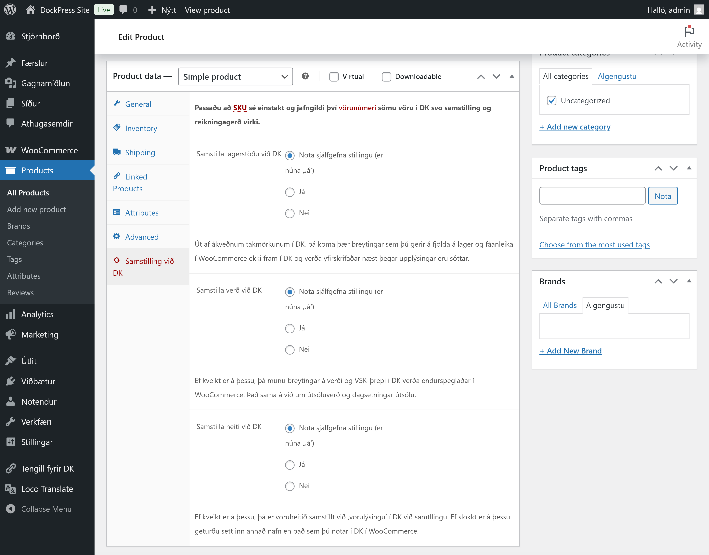

# Vörur

Viðmóti fyrir vörur er haldið svo til óbreyttu nema að bætt hefur verið við sérstökum flipa til að stilla af samstillingu við DK, sem og sérstöku viðmóti fyrir vöruafbrigði sem skráð eru í DK.

Þetta þýðir að þó textareitir fyrir verð o.fl. eru til staðar, þá er skrifað yfir gögn við samstillingu á klukkutíma fresti, eftir því hvaða stillingar hafa verið valdar.

## Samstilling við DK

Hægt er að slökkva og kveikja á, sem og stilla af samstillingu við DK fyrir hverja vöru með því að opna flipann *Samstilling við DK*.

## Vöruafbrigði

Þar sem vöruafbrigði virka ekki eins í DK og í WooCommerce fylgir Tengli fyrir DK viðmót sem smíðað hefur verið frá grunni og er notað þegar vöruafbrigði eru stofnuð í DK.

Þar er hægt að setja inn mynd fyrir hvert afbrigði, stilla af verð, útsölutímabil, fjölda á lager, birgðastöðu o.fl. fyrir hvert vöruafbrigði, þó það sé ekki í boði í DK.

Vegna takmarkana í DK eru þessar breytingar ekki endurspeglaðar í DK og er er ekki hægt að bæta við eiginleikum eða einstökum vöruafbrigðum, heldur er það eingöngu gert DK-megin.
