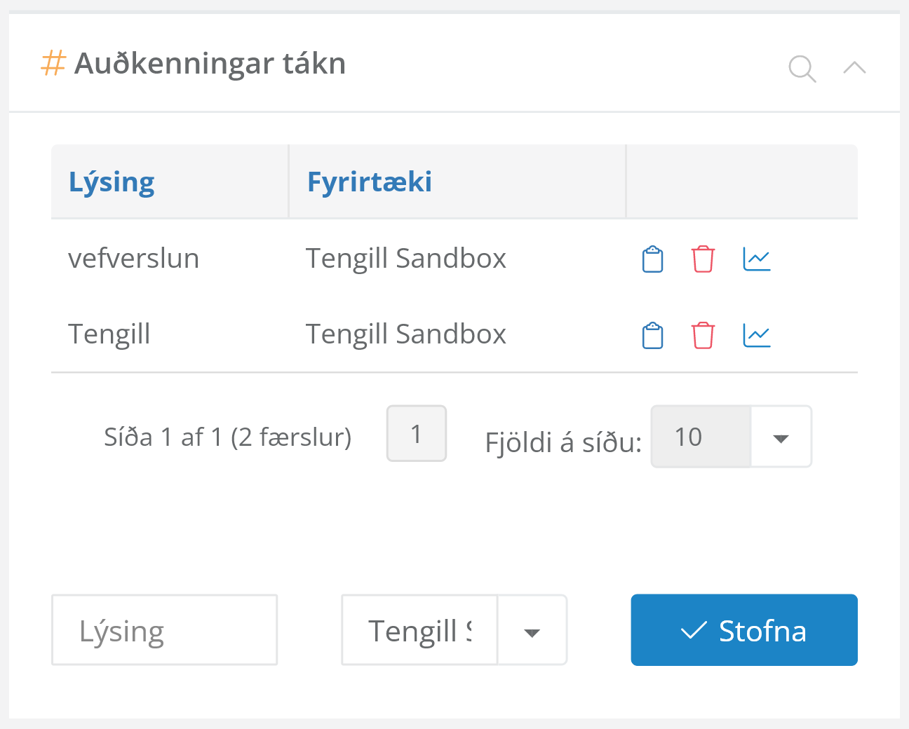

# Öryggi

Leitast er við að tryggja öryggi Tengils fyrir DK í hvívetna. Hér gildir þó alltaf þumalputtareglan *þinn rekstur, þín ábyrgð*.

## Öryggi í DK og dkPlus

Best er að útbúa sérstakan notendaaðgang, starfsmann og sölumannn í dkPlus sem ekki hefur aðgang að neinu öðru en því sem nauðsynlegt er, þ.e.a.s. eingöngu því fyrirtæki sem vefverslunin tilheyrir, sölukerfi, vörum, sölumönnum og skuldunautum en ekki öðrum kerfishlutum á borð við launakerfið, fjárhag eða lánadrottnum. Þessi notandi þarf ekki að hafa kennitölu eða vísa í raunverulegan starfsmann.

Athugið að API-lyklar í dkPlus veita allan þann aðgang sem viðkomandi notandi hefur.

Ennfremur er mælt með því að [skipta út API-lyklum](https://howtorotate.com/docs/introduction/key-rotation-101/) reglulega, sem og eftir að öryggistilvik koma upp og hafa verið leyst.

## Að skipta út API-lyklum

Til að skipta út API-lykli þarf að byrja á því að skrá sig inn sem sá notandi sem er með lykilinn, fara inn í stillingar þess notanda og finna þar valmynd sem heitir „auðkenningar tákn“ og er yfirleitt staðsett neðst til hægri.

Þar er svo hægt að eyða fyrri API-lykli og búa til nýjan. Nýji API-lykillinn er svo færður inn í viðeigandi reit efst í stillingasíðu Tengils fyrir DK í þinni WordPress-uppsetningu.

## Fyrirbyggjandi öryggi í WordPress

Það er góð regla að nota ekki notendaaðgang í WordPres með sem hefur fulla stjórn (e. *administrator* eða *superadmin*) í daglegum rekstri, heldur að búa til notendaaðganga sem er eingöngu með nægjanlegar aðgangsheimildir (t.d. *shop manager*) til að vinna með pantanir og vörur og nota þá í staðinn við daglegan rekstur.

Öll þau verkfæri sem þú notar til að smíða og halda utan um eigin vef eru alfarið á þína ábyrgð.

## Ef upp kemur öryggistilvik í þinni WordPress-uppsetningu

Hvort sem kemur upp öryggisgalli í WordPress-kjarnanum eða þeim viðbótum eða þemum sem þú notar er nauðsynlegt að átta sig á því að ef það kemur upp öryggisgalli í WordPress-viðbótum eða það er brotist inn í WordPress-uppsetninguna þína þarf að taka því alvarlega í skoða gaumgæfilega í hvert skipti og jafnvel loka vefversluninni á meðan.

Þegar Tengill fyrir DK hefur verið uppsettur opnast bein tenging á milli WordPress-uppsetningarinnar þinnar og dkPlus API-viðmótsins, sem síðan tengist við DK. Ef það koma upp öryggis&shy;vandamál; þ.e.a.s. minnsti grunur um að vefurinn þinn hafi verið *hakkaður* er nauðsynlegt að grípa til aðgerða á borð við að skipta um API-lykil og loka þeim gamla sem fyrst.

Einnig er mælt eindregið með því að gera tæknilega og lagalega úttekt þegar slíkt kemur upp.

## Ef upp kemur öryggisgalli í Tengli fyrir DK

Vinsamlegast ekki gefa til kynna eða lýsa öryggisbrotum eða öryggistengdum málum sem varða viðbótina fyrir opnum tjöldum án þess að gera tilraun til að upplýsa um málið á ábyrgan hátt (e. responsible disclosure).

Ef þú tekur eftir öryggisvandamálum með þessa viðbót, þá skaltu hafa samband við Öldu Vigdísi beint í tölvupósti eða með því að nota þar til gert eyðublað á tengillpro.is.
