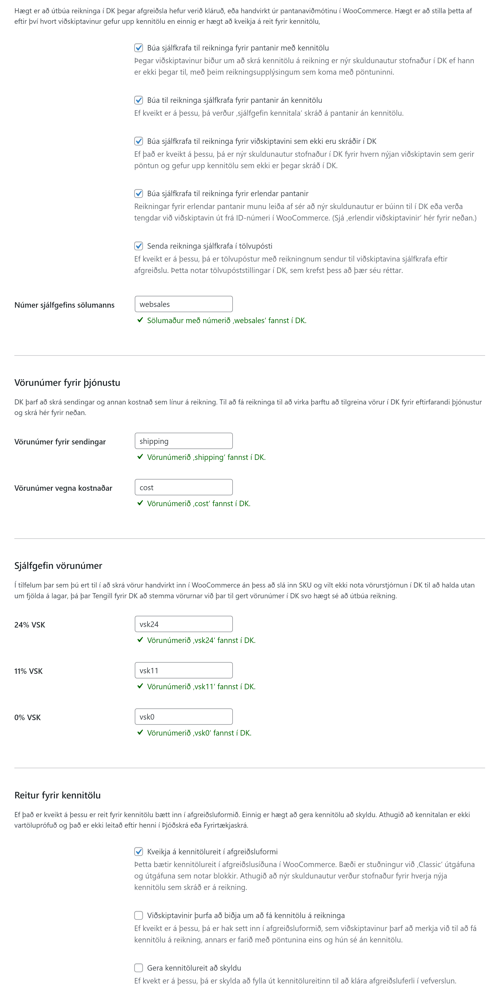

# Stillingar

Stillingasíðan er stór um sig, en það er mikilvægt að fara yfir allar stillingar því hver og ein DK-uppsetning er mismunandi og það getur einnig verið mismunandi eftir hverju fyrirtæki hvaða venjur eru notaðar við DK.

Það eru ýmis stillingaratriði sem þurfa að vera á hreinu áður en næstu skref eru tekin. Það getur verið gagnlegt að fá aðstoð frá þínum eigin bókara, fjármálastjóra eða DK-sérfræðingi áður en þú setur viðbótina upp eða stillir hana af.

## Auðkenning

Eitt sem er gott að hafa í huga er að skipta reglulega um API-lykil; t.d. á 6 mánaða fresti og um leið og grunur leikur á að brotist hafi verið inn í WordPress-vefinn þinn því API-lykillinn getur veitt þeim sem hefur hann undir höndum aðgang að þínum bókhaldsgögnum.

Nánar er fjallað um auðkenningu í kaflanum [Uppsetning](installation.md).

## Greiðslugáttir

Til að hægt sé að útbúa reikninga fyrir pantanir þarf að stemma á milli greiðslugátta í WooCommerce annars vegar og greiðsluaðferðar, greiðslumáta og greiðsluskilmála í DK.

Til að greiðslur séu bókaðar sjálfkrafa á reikning fyrir hverja pöntun þarf svo að haka við hvort færa eigi greiðslulínur á reikninga fyrir hverja greiðslugátt þar sem það á við.

## Vörur

Tengill fyrir DK getur sótt og samstillt upplýsingar um vörur beint frá DK. Upplýsingar á borð við verð, vöruheiti og lýsingu eru færðar beint inn á þær vörur sem skráðar eru með SKU í WooCommerce sem samsvarar vörunúmeri í DK.

Einnig er hægt að skrá vörur beint í WooCommerce þegar þær eru skráðar sem birtar í vefverslun þeim megin.

### Samstilling á vörum

Þegar Tengill fyrir DK hefur verið settur upp er slökkt á samstillingu á vörum. Ef þú kveikir á þessu koma fram nánari stillingar og upplýsingar um vörur eru uppfærðar ásamt öðrum gögnum úr DK á klukkutíma fresti.

#### Uppfæra vöruverð

Ef kveikt er á þessu, þá uppfærir Tengill fyrir DK vöruverð; þar með talið tilboðsverð og tilboðstímabil fyrir þær vörur sem eru samstilltar.

#### Uppfæra lagerstöðu

Ef kveikt er á þessu, þá eru upplýsingar um fjölda á lager og hvort neikvæð lagerstaða sé leyfð fyrir hverja vöru endurspeglað frá DK og yfir í WooCommerce.

#### Uppfæra vöruheiti

Ef kveikt er á þessu, þá eru vöruheiti í WooCommerce reglulega uppfærð út frá vörulýsingu í DK. Í DK er reiturinn vörulýsing notaður til að halda utan um heiti hverrar vöru. Ef þú vilt hafa annað vöruheiti í WooCommerce en í DK, þá geturðu slökkt á þessu.

#### Uppfæra vörulýsingar

Ef kveikt er á þessu, þá eru vörulýsingar í WooCommerce reglulega uppfærðar út frá ‚auka vörulýsingu 1‘ í DK. Ef þú vilt hafa aðra vörulýsingu í WooCommerce í DK, þá geturðu slökkt á þessu.

#### Búa til nýjar vörur í WooCommerce ef þær eru ekki til

Ef kveikt er á þessu, þá eru vörur sem merktar eru í DK sem ‚sýnilegt í vefverslun‘ færðar inn og birtar sjálfkrafa í vefverslun.

#### Eyða vörum úr WooCommerce ef þær eru óvirkar eða þeim hefur verið eytt úr DK

Ef kveikt er á þessu, þá er vörum eytt úr WooCommerce þegar þær eru merktar sem óvirkar, ekki lengur sem sýnilegar í vefverslun eða þeim eytt úr DK.

#### Flytja inn vörur sem eru ekki merktar sem ‚sýnilegt í vefverslun‘ sem drög

Ef það er kveikt á þessu, þá sækir Tengill fyrir DK allar vörur og færir þær inn í WooCommerce. Vörur sem ekki eru merkta sem sýnilegar í vefverslun eru þá merktar sem drög í WooCommerce og hægt að vinna í þeim þar inni; t.d. færa inn myndir og annað áður en þær eru birtar.

### Afbrigði og eiginleikar

DK fer nokkuð óhefðbundnar leiðir til að skrá eiginleika vöruafbrigða en Tengill fyrir DK gerir sitt besta til að vinna með þau og laga að WooCommerce og birtir full heiti og lýsingu eiginleika vöruafbrigða í þeirri rauð sem þau berast frá DK. Ef þú vilt nota þína eigin filtera eða vilt hreinlega birta kóðana sem DK notar beint er hægt að slökkva á þessu.

## Reikningar

### Sjálfvirk reikningagerð

Hægt er að kveikja og slökkva á sjálfvirkri reikningagerð út frá eftirfarandi:

* Pantanir með kennitölu
* Pantanir án kennitölu
* Pantanir viðskiptavina sem ekki eru skráðir sem skuldunautar/viðskiptavinir í DK
* Erlendar pantanir

### Senda reikninga sjálfkrafa í tölvupósti

Hægt er að senda reikninga sjálfkrafa í tölvupósti til þeirra sem gefa upp tölvupóstfang við afgreiðslu. Þetta er *ekki* gert í gegn um WordPress-uppsetninguna þína heldur í gegn um DK og því þarf að ganga úr skugga um að stillingar fyrir tölvupóstsendingar séu réttar í DK og dkPlus.

Til að koma í veg fyrir að reikningar sem sendir eru í tölvupósti séu flokkaðir sem ruslpóstur gæti þurft að færa inn réttar SPF og DKIM-færslur fyrir lénið sem vefverslunin keyrir á.

### Vörunúmer sjálfgefins sölumanns

Í DK þarf alltaf að skrá reikninga á sölumann. Hér er mælt með því að stofna sölumann í DK og sleppa því að skrá hann á einstakling. Best er að hann sé tengdur við sama notanda og API-lykillinn er skráður á. Sjálfgefið númer er `websales`.

### Vörunúmer fyrir þjónustu

Þegar viðskiptavinur er rukkaður fyrir sendingar og kostnað sem reiknaður er út af WooCommerce, þurfa viðeigandi vörunúmer að vera til staðar í DK til að hægt sé að færa það inn á reikning. Athugið að þó verð séu fyrir þessi vörunúmer í DK, þá eru þau verð sem WooCommerce notar færð á reikninginn.

### Sjálfgefin vörunúmer

Þegar ekkert SKU er skilgreint fyrir vöru í WooCommerce getur Tengill fyrir DK valið eitt af þeim vörunúmerum sem skilgreind eru hér og fært þau á reikning þess í stað.

Rétt eins og með þjónustu-vörunúmerin fyrir ofan eru verð úr WooCommerce notuð á reikning, þannig að það verð sem skilgreint er í DK skiptir ekki máli við reikningagerð.

### Reitur fyrir kennitölu

Tengill fyrir DK bætir inn reit fyrir kennitölu. Hér er hægt að slökkva á honum og kveikja og gera hann að skyldu.

Einnig er hægt að bæta við haki til að skrá kennitölur á pantanir í WooCommerce án þess að stofna nýjan skuldunaut í DK.

## Viðskiptavinir

### Sjálfgefin kennitala innlendra viðskiptavina

Hér þarf að skrá kennitöluna sem þú notar fyrir reikninga sem ættu almennt séð ekki að hafa ákveðna kennitölu. Þessi kennitala heitir oft *Almennir skuldunautar* eða *Staðgreiðslureikningar* í DK-uppsetningunni þinni.

### Bókunarflokkur innlendra viðskiptavina

Þegar innlendur viðskiptavinur er stofnaður sem skuldunautur í DK þarf að tilgreina bókunarflokk. Hann er yirleitt `0001`.

### Lokað fyrir viðskipti

Hér er hægt að slá inn þau skilaboð sem birtast viðskiptavini í vefverslun þegar reynt er að ganga frá pöntun ef lokað er fyrir viðskipti. Þegar það gerist er ekki hægt að gefa út reikning.

### Afslættir fyrir viðskiptavini

Hægt er að lesa upplýsingar um verðhópa og fasta afslætti innskráðra viðskiptavina úr DK og birta þau verð í WooCommerce.

Athugið að þetta gildir eingöngu um innskráða viðskiptavini.

### Erlendir viðskiptavinir

Hér er útfært hvernig viðskiptamannanúmer eru útfærð, en erlendir viðskiptavinir eru yfirleitt ekki með kennitölu.

Viðskiptamannanúmer sem eru búin til út frá ID-númeri erlendra viðskiptavina eru 10 stafa runur.

Athugið að hér þarf að passa sig að þau viðskiptamannanúmer sem verða til rekist ekki á kerfiskennitölur, sem byrja ýmist á 8 eða 9. DK tekur við bókstöfum og því er sjálfgefið forskeyti `E` og sjálfgefið númer `E000000000`, en það er hægt að fara aðrar leiðir eins og að byrja viðskiptamannanúmer á `0009`.

Í sumum DK-uppsetningum er annar bókunarflokkur fyrir erlenda viðskiptavini/skuldunauta annar en íslenskra og hér er hægt að stilla hann inn.
